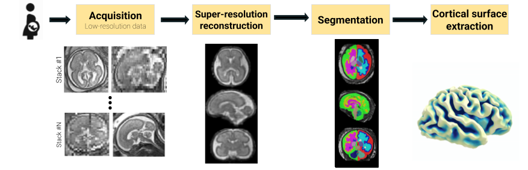

<div class="hero hero--split">
  

  <div class="hero__content">
    <h1 class="hero__title">Fetpype</h1>
    <p class="hero__desc">An Open-Source Pipeline for Reproducible Fetal Brain MRI Analysis</p>
  </div>
</div>


## About
Fetpype is a library that aims at facilitating the analysis of fetal brain MRI by integrating the variety of tools commonly used in processing pipelines. Starting from clinical acquisition of fetal brain MRI (T2-weighted fast spin echo sequences), it performs [pre-processing](preprocessing.md), [reconstruction](reconstruction.md), [segmentation](segmentation.md) and [surface extraction](surface.md).




## The tool
Fetpype aims at integrating a variety of existing tools, available as docker containers into a single, easy to use interface.  It relies on three main components:

- Standardized data formatting following the [BIDS](https://bids.neuroimaging.io/index.html) (Brain Imaging Data Structure) convention.
- Integration of containerized methods using Docker or Singularity.
- Chaining of data calls using [Nipype](https://nipype.readthedocs.io/en/latest/), a library for robust integration of heterogeneous neuroimaging pipelines.
- Simple yaml configuration files generated using [Hydra](https://hydra.cc/docs/intro/).


This package is actively under deployment in a [public GitHub repository](https://github.com/fetpype/fetpype). If you have any question, trouble with the code or desire included a new feature feel free to open an issue there! If you find a typo, or want to include your new method in fetpype, you can submit a pull request (details on how to include your method in fetpype can be found [here](contributing.md)).

## Quick start guide
### Installation
Clone the latest version of the fetpype repository
```
git clone https://github.com/fetpype/fetpype
```

Within your desired python environment, install fetpype
```
pip install -e .
```

### Running your first pipeline
#### Data formatting
Start with a BIDS-formatted dataset containing multiple stacks of low-resolution T2-weighted fetal brain MRI. A BIDS formatted folder should look as follows

```
sub-01
    [ses-01]
        anat
            sub-01_[ses-01]_run-1_T2w.nii.gz
            sub-01_[ses-01]_run-2_T2w.nii.gz
            ...
            sub-01_[ses-01]_run-N_T2w.nii.gz
sub-myname
    [ses-01]
        anat
            sub-myname_[ses-01]_run-1_T2w.nii.gz
            sub-myname_[ses-01]_run-2_T2w.nii.gz
            sub-myname_[ses-01]_run-6_T2w.nii.gz
            sub-myname_[ses-01]_run-7_T2w.nii.gz
    [ses-02]
            sub-myname_[ses-01]_run-1_T2w.nii.gz
            sub-myname_[ses-01]_run-2_T2w.nii.gz
            sub-myname_[ses-01]_run-3_T2w.nii.gz
```

Here, [ses-XX] is an optional tag/folder level. The `anat` folder will contain the different runs, which are the different stacks acquired for a given subject. You can find a more detailed description on this format in our [input data preparation guide](input_data.md). More information about BIDS formatting is available [here](https://bids.neuroimaging.io/index.html).

The output of the pipeline will be saved in the `derivatives` folder, which will contain the different steps of the pipeline, also in BIDS format. You can find a more detailed description of the output data structure [here](output_data.md).

#### Choose what you will run
The pipeline that will be run is defined by a structure of config files. A default pipeline, featuring pre-processing (mask extraction, denoising, cropping and masks), reconstruction (using NeSVoR[@xu2023nesvor]) and segmentation (using BOUNTI[@uus2023bounti]) is defined by the following config file.

It starts by a master config located at `configs/default_docker.yaml` with the following structure
```yaml
defaults:
  - preprocessing/default # Default preprocessing
  - reconstruction/nesvor # NeSVoR reconstruction -- You can choose between svrtk, nifymic or nesvor
  - segmentation/bounti   # BOUNTI segmentation     
  - _self_
container: "docker"       # Running on docker (other option is singularity)
reconstruction:           # Generic reconstruction arguments
  output_resolution: 0.8  # Target resolution for reconstruction
save_graph: True
```
This config defines a pipeline that will run the default preprocessing step (defined in `configs/preprocessing/default.yaml`), the NeSVoR reconstruction pipeline (defined in `configs/reconstruction/nesvor.yaml`) followed by the BOUNTI segmentation pipeline (defined in `configs/preprocessing/bounti.yaml`). Hydra will go in the corresponding folder and load the files to create a global config defined in a nested manner. Changing the pipeline that you want to run is as easy as changing the reconstruction pipeline from `nesvor` to `niftymic`. 

The details of the configs, the attributes and methods implemented is available [in this page](pipelines.md).

### Singularity 
Fetpype also supports running pipelines using Singularity containers. To run your pipeline with Singularity, ensure that you have Singularity installed and available. Currently, singularity images need to be built manually and saved to a folder. You can indicate the folder in the .yaml file in the "singularity_path" field (see configs/default_sg.yaml for an example). The list of images and their name that are needed to run the pipeline is as follows:

- `nesvor.sif` for the NeSVoR pipeline (junshenxu/nesvor:v0.5.0)
- `niftymic.sif` for the NiftyMIC pipeline (from renbem/niftymic:latest)
- `svrtk.sif` for the SVRTK pipeline (from fetalsvrtk/svrtk:general_auto_amd)
- `bounti.sif` for the BOUNTI pipeline (from fetalsvrtk/segmentation:general_auto_amd)
- `fetpype_utils.sif` for the utils pipeline (from gerardmartijuan/fetpype_utils:latest)

#### Just run it!
Once you chose the pipeline that you are going to run, you can then run it by calling 
```
fetpype_run --data <THE_PATH_TO_YOUR_DATA> --out <THE_PATH_TO_YOUR_DATA>/derivatives/fetpype
```

Additional options are available when calling `fetpype_run --help`. Then just wait and see your results! 

#### While you're waiting for the results
Feel free to explore how fetpype works and what it can do!

- [Output data formatting](output_data.md)
- [Running parts of the pipeline](run_parts.md)
- [How can I include my method in fetpype?](contributing.md)


---
## Reference
If you used `Fetpype` in your research, please cite the following paper:
```
@article{sanchez2025fetpype,
  title={Fetpype: An open-source pipeline for reproducible fetal brain mri analysis},
  author={Sanchez, Thomas and Mart{\'\i}-Juan, Gerard and Meunier, David and Ballester, Miguel Angel Gonzalez and Camara, Oscar and Piella, Gemma and Cuadra, Meritxell Bach and Auzias, Guillaume},
  journal={arXiv preprint arXiv:2512.17472},
  year={2025}
}
```

## Contributors

- Gerard Martí-Juan (@[GerardMJuan](https://github.com/GerardMJuan))
- Thomas Sanchez (@[t-sanchez](https://github.com/t-sanchez))
- Guillaume Auzias (@[gauzias](https://github.com/gauzias))
- David Meunier (@[davidmeunier79](https://github.com/davidmeunier79))


## Acknowledgements
Fetpype was funded by [ERA-NET NEURON](https://www.neuron-eranet.eu/) in the context of the MULTIFACT project. It received funding under different national agencies:

- Swiss National Science Foundation — grant 31NE30_203977;
- Spain's Ministry of Science, Innovation and Universities — grant MCIN/AEI/10.13039/501100011033/
- French National Research Agency — grant ANR-21-NEU2-0005;

This project was also supported by the SulcalGRIDS project (ANR-19-CE45-0014) and the SNSF project no. 215641. 


